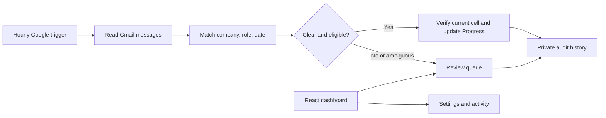

# Application Tracker

Keep a job-search spreadsheet in sync with Gmail without repeatedly checking every application email.

Application Tracker is a personal Google Apps Script web app with a React dashboard. It reads Gmail, matches recruiting messages to existing applications, and can update a Google Sheets **Progress** dropdown every hour. Each person installs a private copy in their own Google account.

**Status:** working personal-install version, tested with a live Gmail account and Google Sheet. This is not a public, one-click SaaS product.

## What it does

- Reads Inbox, archived mail, custom labels, Spam, and Trash without changing email.
- Matches company names (including supported brand aliases and sender names), role words, and application dates before suggesting a change. Role matching tolerates reordered words, common abbreviations, inserted qualifiers, and a single-character typo in long words.
- Automatically applies clear **new** rejection or interview signals when enabled.
- Sends ambiguous matches, assessments, conflicting signals, and Spam to a review queue.
- Protects detected manual Progress edits and existing later-stage statuses.
- Keeps an audit history and source-email links, with guarded undo.
- Processes older mail in resumable batches while checking recent messages separately.

## How it works



The matching engine uses explicit text rules, **not an AI model**. It does not guess that a job offer was accepted. **Job Secured is always manual.** A generic receipt does not move an application backwards.

When automatic updates are enabled, only eligible messages received after that point can change the sheet automatically. Historical messages stay in review. Before a write, the app finds the application again and checks its current status; it records intent, writes the dropdown, verifies the result, and records the completed change.

## Install in your Google account

You do not need Node.js or a paid AI key to install the prebuilt app.

1. Download this repository using **Code → Download ZIP**.
2. Follow [SETUP.md](SETUP.md) to create your own Google Apps Script project.
3. Add the four files from [`google-app/`](google-app/). In Apps Script, name `Matcher.js` **Matcher.gs**.
4. Deploy as a web app, executing as yourself, with access **Only myself**.
5. Authorize access, connect your spreadsheet tab, and run a review scan.
6. Turn on hourly checks and, when ready, automatic updates.

Your spreadsheet must have these columns:

| Column | Value |
|---|---|
| A | Job Title |
| B | Company |
| C | Date Applied |
| D | Progress |
| E | Job Link |

Supported Progress values: `In Consideration`, `Interview Stage`, `Rejected`, `Job Secured`.

## Run the demo and tests locally

Requires Node.js 22.13 or newer.

```sh
npm ci
npm test
npm run build
npm run preview
```

Open `http://127.0.0.1:4174`. The local dashboard uses fictional data and does not connect to Gmail. The build also generates `google-app/Dashboard.html` and `dist/install/application-tracker.zip`.

The live Google version calls the backend through `google.script.run`; the static demo demonstrates the interface only.

## Project structure

| File | Purpose |
|---|---|
| `app/dashboard.tsx` | Applications, review queue, activity log, and settings |
| `google-app/Code.gs` | Gmail scanning, Sheets updates, schedule, audit history, and undo |
| `google-app/Matcher.js` | Pure company/role/date and status-matching rules |
| `google-app/appsscript.json` | Private deployment, Gmail service, and required permissions |
| `google-app/Dashboard.html` | Prebuilt dashboard for Apps Script |
| `tests/tracker.test.mjs` | Matching, write-protection, decoding, and scan tests |
| `scripts/build-google.mjs` | Bundle the dashboard and install package |

## Privacy and permissions

Email processing runs inside the owner's Google Apps Script project. Gmail access is read-only: the app does not send, delete, move, or mark messages as read. The app needs Google Sheets editing access and permission to create background triggers. Google grants Sheets access broadly; the application code limits its writes to the chosen Progress column and a separate private history workbook.

The private history stores application details, message IDs, subjects, senders, source links, and match decisions. It does not store full message bodies. This repository contains no personal mailbox contents, spreadsheet records, account tokens, or private deployment configuration.

## Important limitations

- Matching can still miss unknown company aliases, missing role details, larger spelling differences, or unusual email wording. Company-only matches and multiple candidate applications require review.
- Quoted text and generic company names can cause review items; check the source email before approving.
- Permanently deleted emails cannot be recovered.
- Large mailboxes can take many hourly batches to finish their first scan. Google quotas and service errors can delay processing.
- Google Sheets does not provide an atomic compare-and-write against simultaneous human edits. Pause the tracker during bulk spreadsheet editing.
- The dashboard displays the latest 250 events; the history workbook retains the full record.
- A shared public service would require additional authentication, tenant isolation, hosting, and Google authorization/verification work.

## Validation

49 automated tests cover clear and ambiguous matches, Spam/Trash, manual protection, stale updates, formula protection, audit intent, byte-array/base64url email decoding, and resumable scan behavior. The personal installation was also checked against real Gmail messages and a live Sheet. These checks do not guarantee perfect classification of every email.

## Portfolio summary

Built a job-application tracker with React, Google Apps Script, Gmail API, and Google Sheets. Implemented scheduled email processing, conservative application matching, a review queue, manual-edit protection, resumable backfill, audit history, and guarded updates.

## Attribution

The dashboard uses React, Radix UI/shadcn-style components, Lucide icons, and Tailwind CSS. Bundled third-party license notices are retained in the generated dashboard and `vendor/`. Publishing a repository does not automatically grant an open-source license; no project-wide reuse license is included in this private version.
